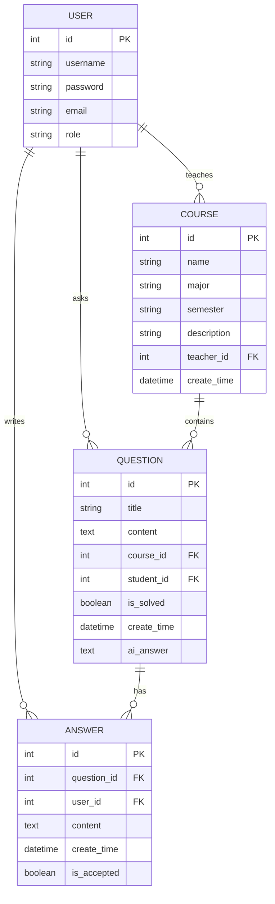

# 高校课程问答系统 ER 图（按 demo 项目源码生成）

这版 ER 图依据项目中的实体类生成，来源文件如下：

- [User.java](D:/WEB/demo/src/main/java/org/wy/demo/entity/User.java)
- [Course.java](D:/WEB/demo/src/main/java/org/wy/demo/entity/Course.java)
- [Question.java](D:/WEB/demo/src/main/java/org/wy/demo/entity/Question.java)
- [Answer.java](D:/WEB/demo/src/main/java/org/wy/demo/entity/Answer.java)

## 论文说明文字

根据系统实际实现情况，数据库核心实体主要包括用户表、课程表、问题表和回答表。用户表用于保存系统用户的基本信息，包括用户名、密码、邮箱和角色类型；课程表用于记录课程名称、所属专业、开课学期、课程描述以及授课教师信息；问题表用于存储学生在具体课程下提出的问题，同时记录问题是否解决、创建时间以及 AI 回答内容；回答表用于保存教师或其他用户对问题的回复，并记录回答时间及是否被采纳。实体之间通过外键建立关联关系，其中教师与课程之间为一对多关系，课程与问题之间为一对多关系，学生与问题之间为一对多关系，问题与回答之间也为一对多关系。
